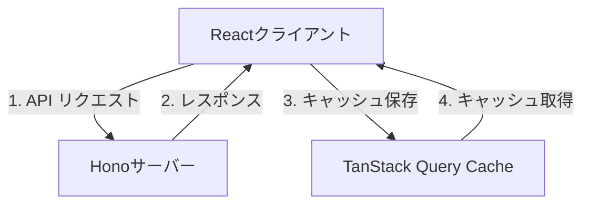
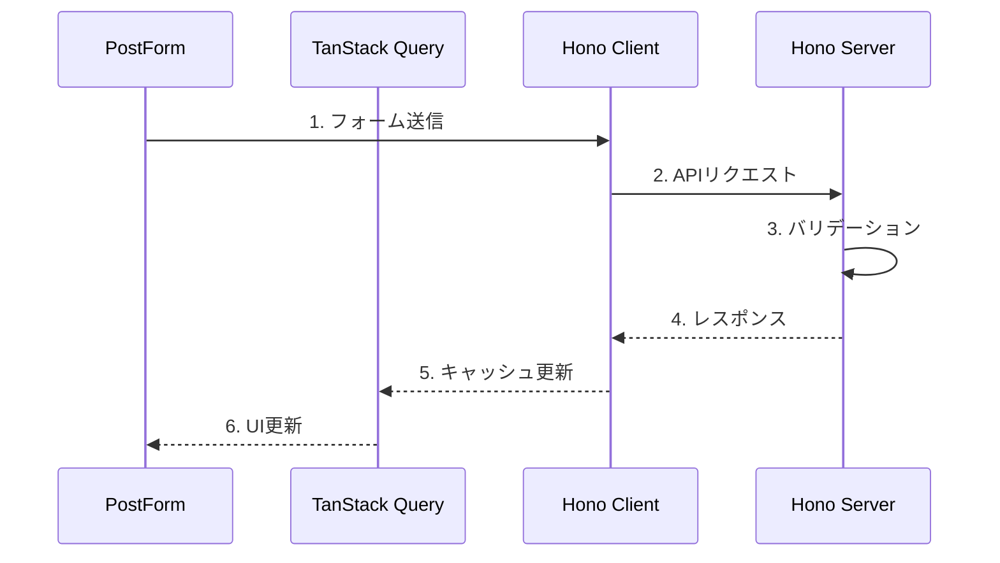

# System Patterns: Hono RPC Example

## アーキテクチャパターン



## データフロー

### 1. CRUD フロー



## 主要コンポーネント

### サーバーサイド

1. ルーティング構造

```
/posts
├── GET /        - 全件取得
├── POST /       - 新規作成
├── GET /:id     - 1件取得
├── PUT /:id     - 更新
└── DELETE /:id  - 削除
```

2. データバリデーション

```typescript
const postSchema = z.object({
  id: z.string(),
  fullname: z.string(),
  age: z.number(),
});
```

### クライアントサイド

1. 状態管理パターン

- TanStack Query によるサーバー状態管理
- React Hook Form によるフォーム状態管理
- Zod によるバリデーション

2. コンポーネント構造

```
src/
├── components/
│   ├── PostForm  - 登録フォーム
│   └── PostList  - 一覧表示
└── querys/
    └── posts     - API通信ロジック
```

## デザインパターン

1. Custom Hook パターン

- `usePostForm` - フォーム操作の抽象化
- `usePostList` - リスト表示の抽象化

2. Optimistic Update パターン

- キャッシュの即時更新
- バックグラウンドでの再検証

3. Type Safe API パターン

- Hono の型定義からクライアントの型を生成
- エンドポイントごとの型安全性保証
