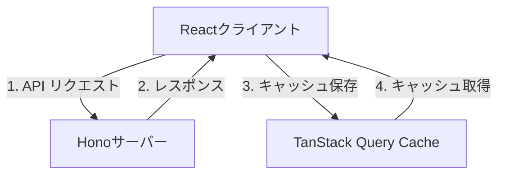
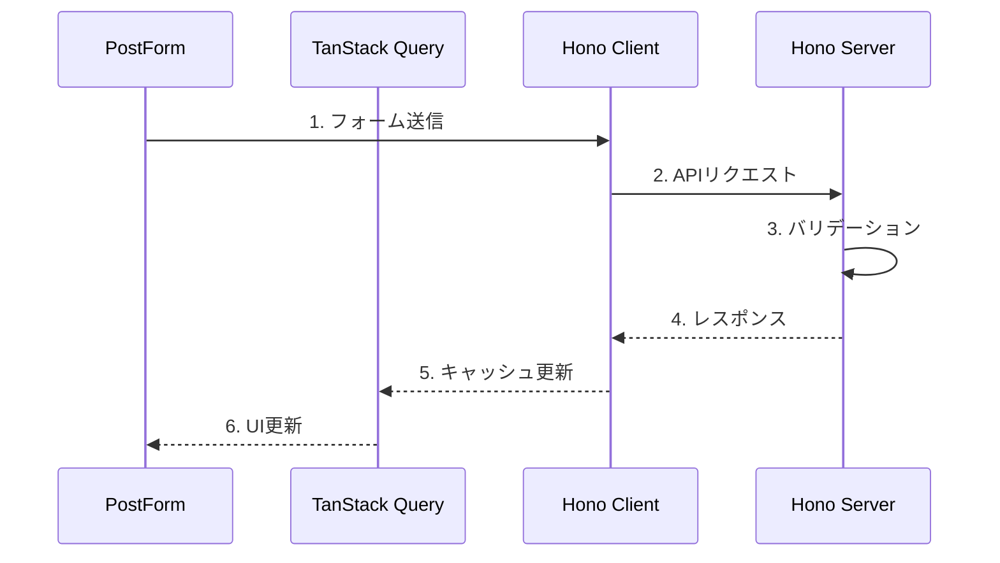

# System Patterns: Hono RPC Example

## アーキテクチャパターン



## データフロー

### 1. CRUD フロー



## 主要コンポーネント

### サーバーサイド

1. ルーティング構造

```
/posts
├── GET /        - 全件取得
├── POST /       - 新規作成
├── GET /:id     - 1件取得
├── PUT /:id     - 更新
└── DELETE /:id  - 削除
```

2. データバリデーション

```typescript
const postSchema = z.object({
  id: z.string(),
  fullname: z.string(),
  age: z.number(),
});
```

### クライアントサイド

1. 状態管理パターン

- TanStack Query によるサーバー状態管理
- React Hook Form によるフォーム状態管理
- Zod によるバリデーション

2. コンポーネント構造

```
src/
├── components/
│   ├── PostForm  - 登録フォーム
│   └── PostList  - 一覧表示
└── querys/
    └── posts     - API通信ロジック
```

## デザインパターン

1. Custom Hook パターン

- `usePostForm` - フォーム操作の抽象化
- `usePostList` - リスト表示の抽象化

2. Optimistic Update パターン

- キャッシュの即時更新
- バックグラウンドでの再検証

3. Type Safe API パターン

- Hono の型定義からクライアントの型を生成
- エンドポイントごとの型安全性保証

4. Test Patterns

- セットアップ/共通処理の抽象化

  ```typescript
  // 共通のテストヘルパー
  function setupTestApp() {
    const mockRepository = { ... };
    return { client, mockRepository };
  }
  ```

- DI コンテナを使用したモック注入

  ```typescript
  // モックの注入
  container.register("IPostsRepository", {
    useValue: mockRepository,
  });
  ```

- 正常系/異常系の網羅的テスト
  ```typescript
  describe('API Endpoint', () => {
    it('正常系: 期待した結果を返すこと', () => { ... });
    it('異常系: エラーを適切にハンドリングすること', () => { ... });
  });
  ```

5. Error Handling Patterns

- エラー発生時の段階的な対応

  ```typescript
  // エラーハンドリングフロー
  try {
    // 1. 最初の修正を試行
    await firstAttempt();

    if (error) {
      // 2. エラーが解消されない場合は処理を中断
      stopProcessing();

      // 3. エラー情報を共有して解決策を検討
      await shareErrorDetails({
        error,
        attemptedFix,
        currentState,
      });
    }
  } catch (error) {
    handleError(error);
  }
  ```

- チーム開発での対応フロー

  ```mermaid
  flowchart TB
    Error[エラー発生] --> Clarify[エラー内容の明確化]
    Clarify --> Record[試行した修正内容の記録]
    Record --> Explain[現状の詳細な説明]
    Explain --> Collaborate[共同での解決策検討]
    Collaborate --> Fix[修正実施]
  ```

- エラー情報の構造化
  ```typescript
  interface ErrorContext {
    error: Error;
    location: string;
    attemptedFixes: string[];
    currentState: {
      input?: unknown;
      environment: string;
      timestamp: Date;
    };
  }
  ```
